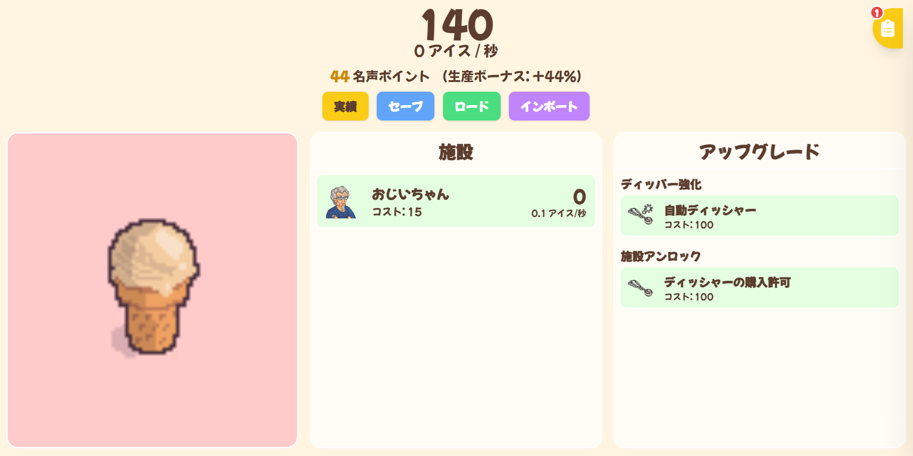
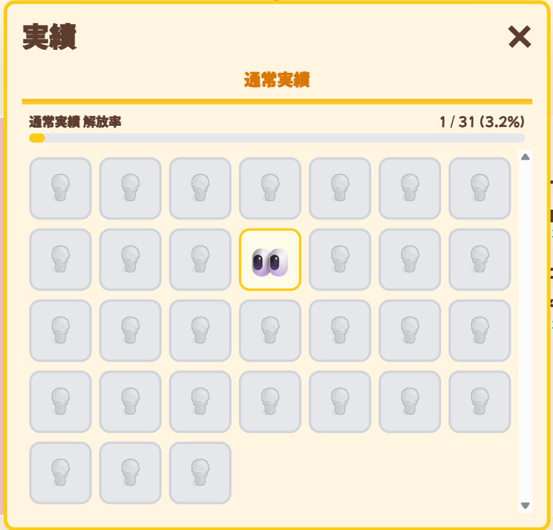
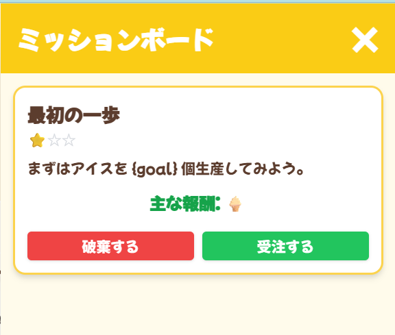

# Ice Cream Clicker REMAKE

**これは、一本のアイスから始まり、銀河を支配するに至る物語。**

## 物語

あなたの壮大なビジネスは、一本のバニラアイスを売ることから始まります。しかし、その小さな一歩が、やがて宇宙の果てまでを巻き込む巨大なアイスクリーム帝国へと繋がる道なのです。

最初は、近所のおじいちゃんの手を借りるだけかもしれません。しかし、あなたの情熱と経営手腕が、やがてはアイスクリームカートの行列を生み、街角にスタンドを構え、ついには月面にまで基地を建設させることになるでしょう。これは単なるクリッカーゲームではありません。あなたの野望と戦略が試される、甘くて冷たい経営シミュレーションです。

## ゲームの魅力

### スクリーンショット

**メイン画面**

*ここがあなたの帝国の中心。すべての指示はここから下されます。*

**実績システム**

*王道を征く者か、誰も知らない裏道を歩む者か。あなたのプレイスタイルが実績となって刻まれます。*

**ミッションボード**

*あなたの名声を聞きつけた者たちから、次々と依頼が舞い込みます。こなせば莫大な報酬が…？*

## 帝国を築くための主要機能

* **始まりの一杯、そして無限へ**
  単純なクリックが、やがて天文学的な数のアイスクリームを生み出す第一歩。あなたの指先から伝説は始まります。

* **拡大する生産ライン**
  頼りになる「おじいちゃん」から、惑星まるごとアイスに変えてしまう「アイスクリーム火山」、果ては時空すら歪める「ブラックホール冷凍庫」まで。あなたの想像を絶する施設が、帝国を支えます。

* **技術革新による圧倒的成長**
  ただ数を増やすだけが能じゃない。アップグレードで生産効率を飛躍的に高め、ライバルを置き去りにしましょう。

* **伝説に名を刻む「実績」**
  ゲームの進行度を示す数々の実績。中には、常識外れのプレイでしか解除できない「隠し実績」も…。全ての伝説を、その目に焼き付けよ。

* **舞い込む緊急ミッション**
  あなたの活躍は常に注目の的。突如として舞い込むミッションを達成し、莫大な報酬を手に入れましょう。

* **万全のセーブ機能**
  あなたの築き上げた帝国は、決して消えません。いつでも中断し、いつでも覇道に戻ることができます。データの移行も可能です。

## アイスクリーム大富豪への道

1. まずは無心で**アイスクリームをクリック**。全ての富はここから生まれる。

2. 資金が貯まったら**施設**に投資。自動化こそが帝国への近道だ。

3. **アップグレード**を吟味し、最適な投資で生産性を爆発させろ。

4. 時折**ミッション**をこなし、**実績**を解除して、自らの伝説を世界に示せ。

## 開発技術

* HTML

* CSS (Tailwind CSS)

* JavaScript (Vanilla JS)

さあ、世界を、いや、宇宙を甘い幸せで満たす準備はできましたか？